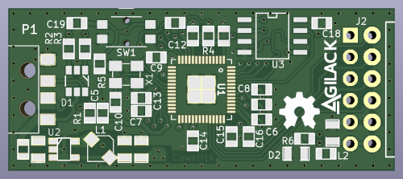
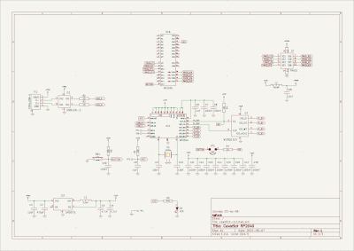
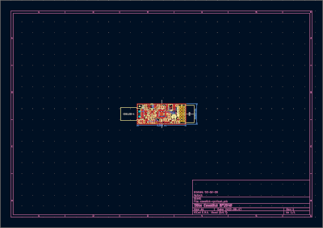

PMOD usbkey
===========

This usb-key is part of cowstick boards family and offer a compact PMOD host
interface. It can be used to test or use most 3,3V PMOD devices, for other
power supplies, a level translator should be used.

For the moment, this module is not supported by cowlab but will be added
soon.

CAD source
----------

This board has been designed using KiCad EDA (version 6). All sources files
(schematics, routing, ...) are available into the `hardware/prj-kicad` folder.

<table>
<tr>
<td></td>
<td></td>
</tr>
<tr>
<td>Fig1: Preview of the KiCad schematics</td>
<td>Fig2: Preview of the KiCad routing</td>
</tr>
</table>

License
-------

This project is OpenHardware. You can use (and/or modify) this project under
terms of the Creative Commons ShareAlike license (CC-by-SA).
See [hardware/LICENSE.md](hardware/LICENSE.md).
